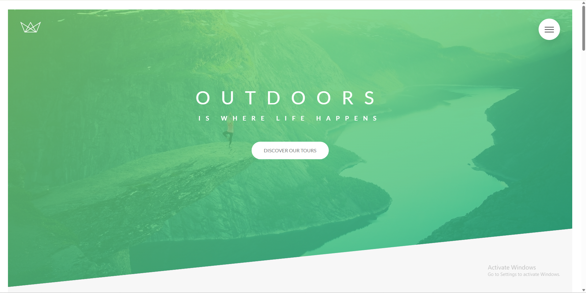

# 🌿 Natours

Natours is a responsive travel and adventure landing page built using **HTML** and **SCSS**. The project focuses on creating a modern, visually appealing user interface with reusable components, responsive layouts, and smooth CSS animations.

> **Note:** This is a frontend UI project and does not include backend functionality or interactive booking features.

---

## ✨ Features

- 🌍 Modern travel landing page
- 📱 Fully responsive design
- 🎨 Built with SCSS
- 🧩 Reusable UI components
- ✨ Smooth CSS animations
- 📐 Responsive grid layouts
- 🖼 Beautiful image composition
- 🎯 Clean and organized code structure

---

## 🛠 Technologies Used

- HTML5
- SCSS (Sass)
- CSS3

---

## 📁 Project Structure

```
Natours/
├── css/
├── sass/
├── img/
├── index.html
└── README.md
```

---

## 🚀 Getting Started

### 1. Clone the repository

```bash
git clone https://github.com/prahans/Natours.git
```

### 2. Navigate to the project

```bash
cd Natours
```

### 3. Install dependencies (if using Sass)

```bash
npm install
```

### 4. Compile SCSS

```bash
npm run compile:sass
```

_(Or use the script configured in your project.)_

### 5. Open the project

Open `index.html` in your browser.

---

## 📸 Screenshot

Add a screenshot of the homepage here.

Example:

```html
<p align="center">
  
</p>
```

---

## 📚 What I Learned

This project helped me strengthen my understanding of:

- Semantic HTML
- SCSS Architecture
- CSS Flexbox
- CSS Grid
- Responsive Web Design
- CSS Animations
- Reusable Components
- Modern UI Development

---

## ⭐ Support

If you found this project helpful, consider giving it a ⭐ on GitHub.

---

## 📄 License

This project is for educational purposes only.

//written by anurag
Natours
lean about atomic design from this youtube video -> https://youtu.be/Yi-A20x2dcA?si=FQaVaMYF7OT_T4kq

BEM -> Block Element Modifier
BLOCK : standalone component that is meaningful on its own.
ELEMENT : part of a block that has no standalone meaning.
MODIFIER : a different version of a block or element.

.block {}
.block**element {}
.block**element--modifier {}

- ARCHITECT
  THE 7-1 PATTERN
  7 different folders for partial Sass files, and
  1 main Sass file to import all others files into a compiled CSS stylesheet.

THE 7 FOLDERS
.base/
.components/
.layout/
.pages/
.themes/
.abstracts/
.vendors/

we can use :not sudo class
