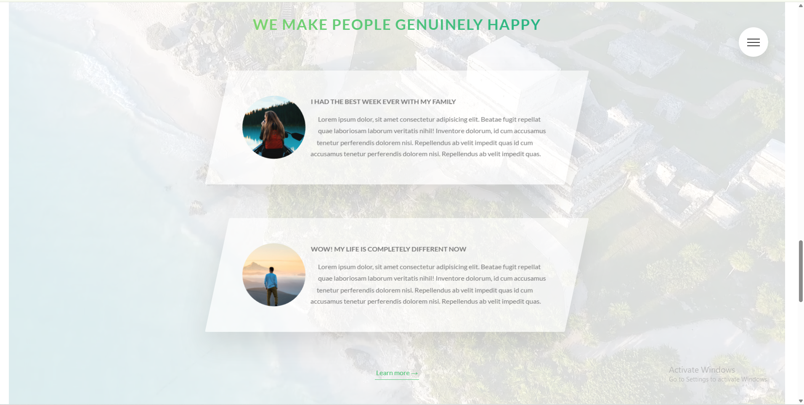
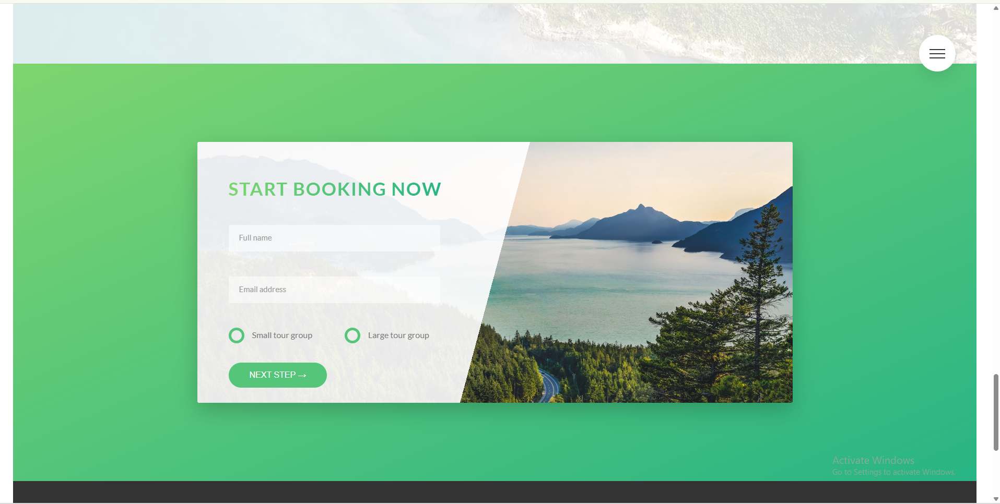
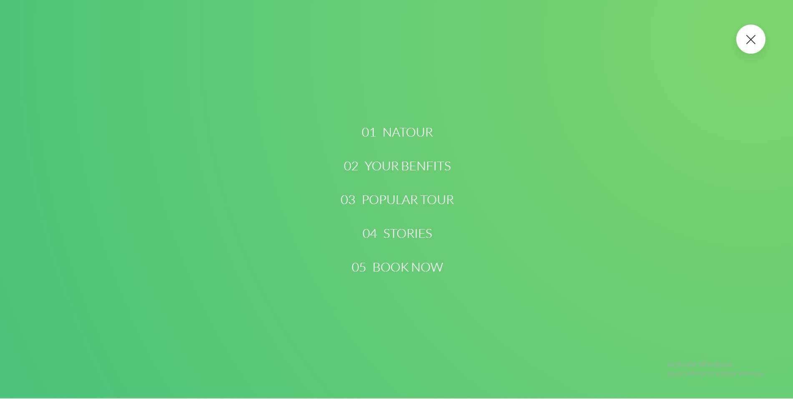
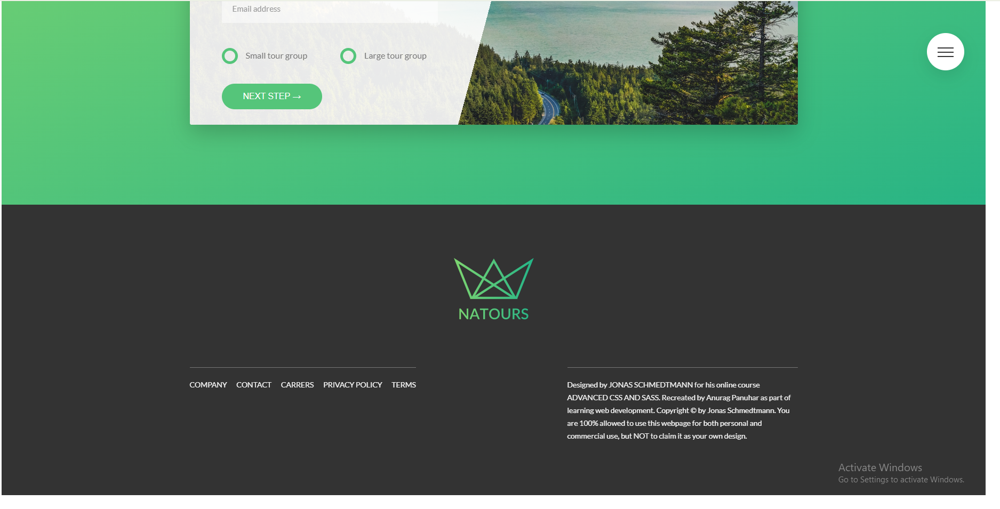

# 🌿 Natours

This project was built as part of the **Advanced CSS and Sass** course by Jonas Schmedtmann.

The design, layout, and project concept are from the course and are the intellectual work of Jonas Schmedtmann. I recreated this project by following the course for educational purposes to practice my HTML, CSS, and Sass skills.

This repository is intended to showcase my learning journey and implementation, not to claim ownership of the original design.

## Credits

- Course: Advanced CSS and Sass
- Instructor: Jonas Schmedtmann

## 📸 Screenshot

<table>
  <tr>
    <td align="center">
      
    </td>
    <td align="center">
      
    </td>
  </tr>

  <tr>
    <td align="center">
      
    </td>
    <td align="center">
      
    </td>
  </tr>

  <tr>
    <td align="center">
      
    </td>
    <td align="center">
      
    </td>
  </tr>

  <tr>
    <td align="center">
      
    </td>
    <td align="center">
      
    </td>
  </tr>
</table>

---

## Natours

lean about atomic design from this youtube video -> https://youtu.be/Yi-A20x2dcA?si=FQaVaMYF7OT_T4kq

BEM -> Block Element Modifier
BLOCK : standalone component that is meaningful on its own.
ELEMENT : part of a block that has no standalone meaning.
MODIFIER : a different version of a block or element.

.block {}
.block**element {}
.block**element--modifier {}

- ARCHITECT
  THE 7-1 PATTERN
  7 different folders for partial Sass files, and
  1 main Sass file to import all others files into a compiled CSS stylesheet.

THE 7 FOLDERS
.base/
.components/
.layout/
.pages/
.themes/
.abstracts/
.vendors/

we can use :not sudo class
